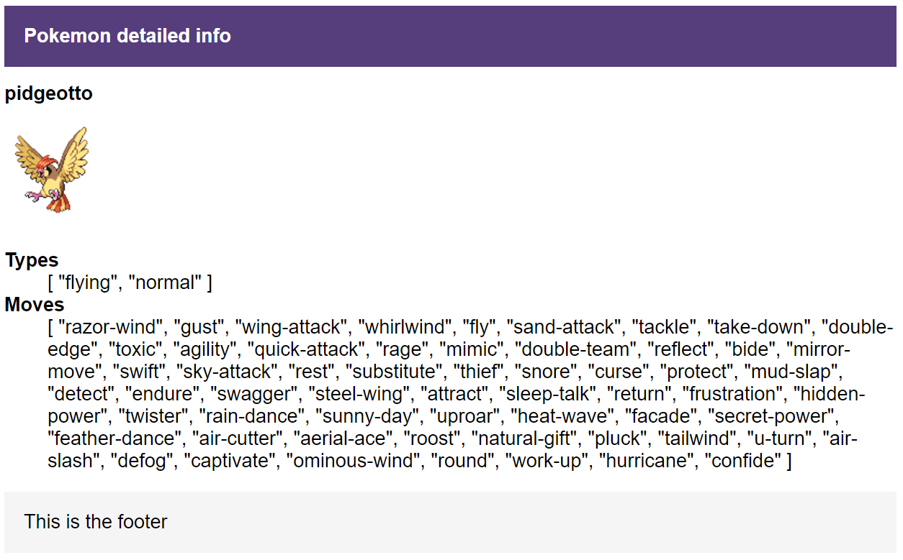
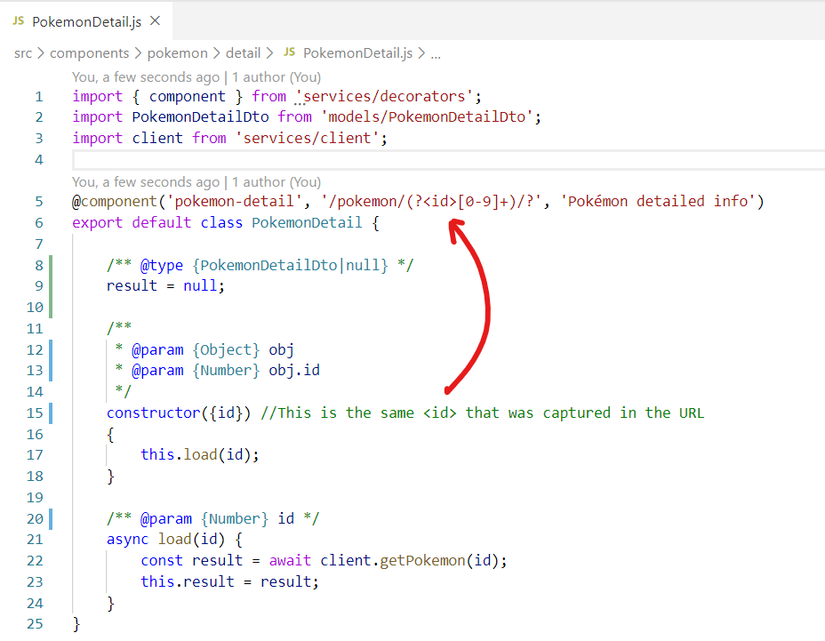
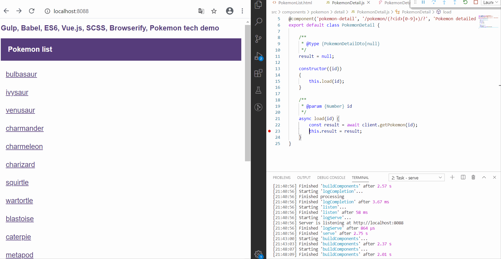

# Gulp, Babel, ES6, decorators, async/await, Vue.js, SCSS, Browserify, Live Reload, Source Maps, Pokémon demo
A quick experiment into modern JavaScript development with the MVVM pattern.

## Why it's cool
 * Small, single resposibility components;
 * Simple ES6 classes, nicely decoupled from the rendering library (Vue.js in this case);
 * It leverages the language capabilities: use public properties to expose data to the ViewModel; keep them private for internal state;
 * Use of decorators to configure components and their route pattern;
 * All scripts and templates packed in a single `app.js` file;
 * Works on Internet Explorer 10-11;
 * Live reloading for improved productivity;
 * Pokémon.

If you want to review the code, start by looking at the [MainLayout](./src/components/layout/MainLayout.js) class, then see other components classes such as [PokemonList](./src/components/pokemon/list/PokemonList.js) and [PokemonDetail](./src/components/pokemon/detail/PokemonDetail.js).

## Getting started
 * Open the console and run `npm install`. This project was developed on Node 12;
 * Then run `npm run build` (Ctrl+Shift+B on VSCode) to build the application or just run `npm run serve` to build and spawn a webserver;
 * Built output is in the `dist` directory.

## Debug
This project supports debugging with the [Debugger for Chrome Extension](https://marketplace.visualstudio.com/items?itemName=msjsdiag.debugger-for-chrome). Hit F5 on VSCode and start debugging.

## TODO
 * Event publishing and handling;
 * Computed properties;
 * Component properties;
 * Unit testing;
 * Dependencies cleanup.